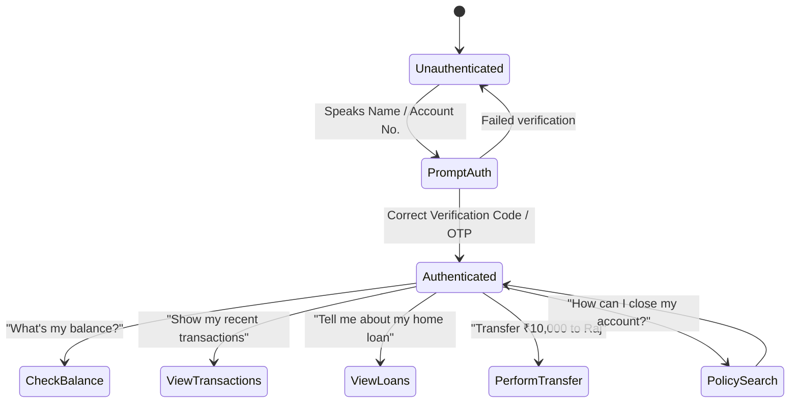

# Implementation Plan - Complete BankVerse Voice Integration

This plan outlines the architecture, database schema, AI routing logic, frontend layout, and verification steps to transform BankVerse Voice into a fully functional, premium banking assistant. It also defines a sequence of at least 20 Git commits to fulfill the commit requirement.

---

## 1. Upgraded Database Schema & Seeding (`bank_data.db`)

We will replace the single-table `accounts` database with a comprehensive, multi-table banking database. This supports realistic queries like customer verification, detailed transaction histories, active loans, and dynamic policy checks.

### Schema design:
*   **`customers`**: `customer_id` (PK), `name` (text), `phone` (text), `email` (text), `kyc_status` (text), `credit_score` (int), `verification_code` (text, e.g., mock voice-OTP).
*   **`accounts`**: `account_number` (PK, text), `customer_id` (FK), `account_type` (text: savings, current, fd, loan), `balance` (real), `status` (text).
*   **`transactions`**: `transaction_id` (PK, autoincrement), `account_number` (FK), `type` (text: credit, debit), `amount` (real), `timestamp` (datetime), `description` (text).
*   **`loans`**: `loan_id` (PK, text), `customer_id` (FK), `loan_type` (text: home, auto, personal), `amount` (real), `interest_rate` (real), `outstanding_balance` (real), `emi_amount` (real), `next_emi_date` (text).
*   **`policies`**: `policy_id` (PK, text), `topic` (text, search key), `policy_name` (text), `policy_content` (text).

We will write a seeding script (`init_db.py`) to set up these tables and populate them with diverse records for testing.

---

## 2. Backend Orchestration & Interactive AI Flow

We will build a `db_manager.py` component to wrap all database actions.
The `main.py` file will be refactored to support stateful WebSocket sessions. The session will track:
1.  **Authenticated Customer ID**: Starts as `None`. The user must state their name or account number, and verify their identity (mock voice OTP/PIN verification) to unlock sensitive account lookup tools.
2.  **Tool Orchestration**:
    *   **Customer Search & Authentication**: LLM verifies name/ID, sets customer context.
    *   **Balance Retrieval**: Queries `accounts` for the authenticated customer.
    *   **Transaction Lookup**: Retrieves the last 5 transactions for the customer's account.
    *   **Loan Details Retrieval**: Fetches outstanding loan amounts and interest rates.
    *   **Dynamic Policy Retrieval**: Queries the `policies` table using keyword matching (replaces hardcoded strings).
    *   **Mock Funds Transfer**: Debits the customer's savings account and credits the recipient, inserting transaction logs.

### AI State Machine:

---

## 3. Premium Frontend Revamp

We will modernize the frontend (`App.jsx`, `index.css`, `App.css`) to align with rich web design aesthetics:
-   **Theme & Glassmorphic Design**: Deep dark space slate background with glowing neon ambient backdrops, premium gradients, and clean borders.
-   **Customer Context Dashboard Widget**: Displays details of the authenticated customer (e.g., credit score tracker gauge, KYC indicator, active accounts).
-   **Interactive Accounts & Transactions Hub**: Shows beautiful debit/credit cards and a detailed table of recent transactions that updates dynamically.
-   **Live Audio Waveform Visualizer**: A custom canvas/CSS waveform animation that bounces in real-time when the mic is recording.
-   **Speech & Voice Configuration Drawer**: Controls playback rate, language selection (adds Hindi in addition to English and Marathi), and toggles auto-speak.
-   **Interaction History with Search/Filtering & PDF Summary Export**: Allow filtering through old speech messages and download a PDF summary.

---

## 4. Verification Plan

### Automated Tests
*   **Database Tests**: Verify queries (balance, transactions, transfers, policies) operate correctly.
*   **API/WebSocket Integration Tests**: Write test cases in Python using `pytest` and `fastapi.testclient` to run mock conversation transcripts and check the JSON responses.

### Manual Verification
*   We will run the FastAPI server and Vite dev server, and check the features in a browser (either via automation or manual guidance).

---

## 5. Commit Roadmap (At least 20 Commits)

We will execute this plan using incremental, logical commits:

1.  `docs: Create implementation plan and task tracking` [This step]
2.  `database: Update schema definitions in init_db.py`
3.  `database: Seed multi-table mock data in init_db.py`
4.  `backend: Create db_manager.py module for SQL queries`
5.  `backend: Implement customer search and validation in db_manager`
6.  `backend: Add transfer and transaction logging in db_manager`
7.  `backend: Implement policy lookup in db_manager`
8.  `test: Create unit tests for db_manager.py`
9.  `backend: Integrate db_manager into main.py and configure imports`
10. `backend: Support customer authentication state in WebSocket connection`
11. `backend: Implement check_balance tool with dynamic customer state`
12. `backend: Implement transactions tool in WebSocket pipeline`
13. `backend: Implement loan details tool in WebSocket pipeline`
14. `backend: Implement fund transfer tool in WebSocket pipeline`
15. `backend: Implement dynamic database policy search in WebSocket pipeline`
16. `backend: Support Hindi language translations and voice outputs`
17. `test: Write API integration tests for WebSocket endpoints`
18. `frontend: Update CSS for glassmorphic banking theme`
19. `frontend: Integrate dynamic customer details and balances widget`
20. `frontend: Add recent transactions table and transfers trigger`
21. `frontend: Build live audio waveform animation`
22. `frontend: Add speech options panel (voice speed, language toggle)`
23. `frontend: Add PDF interaction summary downloader`
24. `docs: Update system documentation and walkthrough`
