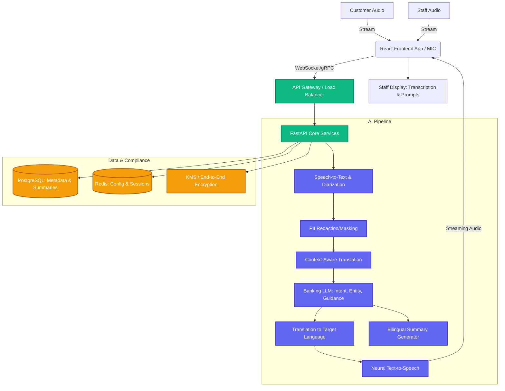

# BankVerse Voice: Multilingual Gen-AI Assistant Architecture

## 1. High-Level Architecture Design

## 2. Detailed Component Breakdown

### Frontend (Staff Interface)
- **Tech Stack**: React.js / Vite, Tailwind CSS, WebRTC/WebSockets for low-latency audio streaming.
- **Role**: Captures audio using the device microphone. Displays real-time bilingual transcriptions, process guidance prompts, and auto-populated summaries. Includes adjustable playback controls for TTS.

### Backend (Microservices Core)
- **Tech Stack**: Python, FastAPI, gRPC/WebSockets, Docker, Kubernetes.
- **Role**: Orchestrates the communication between the frontend and the AI models. Handles session management, API routing, and security/authentication (Role-Based Access Control).

### Database & Caching
- **Tech Stack**: PostgreSQL (Relational Data), Redis (In-memory Cache).
- **Role**: PostgreSQL stores branch info, user roles, interaction metadata, and the bilingual summaries (encrypted). Redis handles rapid session state retrieval and limits latency for active conversations.

### Cloud Deployment
- **Strategy**: Multi-Zone Private Cloud Setup (e.g., Azure with strict VNet isolation, aligned with RBI guidelines). Uses Kubernetes (e.g., Azure Kubernetes Service) for managing containerized backend services, allowing auto-scaling across 1000+ branches.

## 3. Data Flow Explanation

1. **Audio Capture**: A microphone array at the staff desk captures both the customer and staff's voices. WebRTC streams this audio to the backend.
2. **Diarization & ASR**: The pipeline identifies the speaker (Staff vs. Customer) in real-time and transcribes the speech to text in the original language.
3. **PII Masking & Translation**: Any sensitive data (e.g., account numbers spoken aloud) is masked. The customer's transcribed text is translated into the staff's preferred language (and vice-versa).
4. **Context Analysis (LLM)**: The translated text is passed to the banking-domain LLM. The LLM extracts intent (e.g., "Open Fixed Deposit"), identifies entities, and generates step-by-step guidance prompts for the staff.
5. **Synthesis (TTS)**: When the staff responds, their translated speech is fed into a Neural TTS engine, generating an audio response in the customer's preferred language.
6. **Delivery**: The synthesized audio is streamed back to the frontend to be played via a speaker for the customer, while the staff sees the real-time transcription and prompt guidance on their screen.
7. **Post-Interaction**: The system generates a bilingual summary and securely logs it to the database for compliance.

## 4. AI Model Pipeline Explanation

- **Speech-to-Text (ASR)**: **Azure STT / Custom Whisper** fine-tuned on Indian accents and regional languages (Hindi, Marathi, Tamil, etc.). Includes a custom vocabulary for banking terms (EMI, KYC, Moratorium).
- **Translation (NMT)**: **Bhashini API or Azure Translator** optimized for financial terminology to prevent literal translations that lose meaning.
- **Banking LLM**: **Fine-tuned Llama-3 / GPT-4o (Private Azure deployment)**. Acts as the intelligent brain. Prompt-engineered and fine-tuned to understand banking contexts, extract actionable entities, maintain a polite tone, and strictly avoid hallucinations regarding banking policies.
- **Text-to-Speech (TTS)**: **Azure Neural TTS**. Provides natural, high-fidelity voices supporting multiple regional languages. Speed is adjustable programmatically via SSML tags to accommodate elderly customers.

## 5. Implementation Roadmap (Phase 1 → Phase 3)

### Phase 1: MVP & Proof of Concept (Months 1 - 3)
- **Goal**: End-to-end pipeline validation.
- **Deliverables**: 
  - Standardized English + 2 Regional Languages (e.g., Hindi, Tamil).
  - Basic React frontend with audio streaming.
  - ASR -> Translation -> TTS pipeline operational.
  - Deployment in a sandbox environment.

### Phase 2: Banking Integration & Pilot (Months 4 - 6)
- **Goal**: Contextual mapping and real-world trials.
- **Deliverables**:
  - Integrate Banking LLM for Process Guidance (Account opening, Loan enquiry).
  - Implement PII redaction and Bilingual Summary Generation.
  - Pilot deployment in 5-10 controlled branch environments.
  - Gather feedback on translation accuracy and TTS naturalness.

### Phase 3: Scaling & Optimization (Months 7 - 12)
- **Goal**: Enterprise rollout and high performance.
- **Deliverables**:
  - Expand to support all major Indian regional languages.
  - Latency optimization (aiming for sub-1.5s turnaround via chunked processing).
  - High Availability Kubernetes rollout for 1000+ branches.
  - Integration with CRM and Core Banking APIs to auto-populate customer details.

## 6. Challenges & Mitigation Strategies

| Challenge | Mitigation Strategy |
| :--- | :--- |
| **High Latency** | Implement streaming ASR/TTS (chunked audio processing). Use WebSocket connections. Cache common LLM responses. |
| **Translation Inaccuracies** | Maintain a strict internal glossary of banking terms. Fine-tune NMT models specifically on financial domain corpora. |
| **Data Privacy (Compliance)** | Deploy entirely within a designated Indian cloud region. Implement absolute zero-retention policies for raw audio. Mask PII before LLM processing. End-to-end encryption (TLS 1.3, AES-256). |
| **Background Noise in Branches** | Utilize hardware-level noise cancellation microphones. Apply AI-based noise suppression models before ASR processing. |

## 7. Future Scalability Features

- **Edge Processing**: Moving lightweight ASR and VAD (Voice Activity Detection) models directly to branch devices (Edge AI) to massively reduce bandwidth and cloud compute costs.
- **Omni-Channel Integration**: Expanding the Voice Assistant engine to power Telephone IVR systems and mobile banking apps using the same backend infrastructure.
- **Voice Biometrics**: Seamlessly authenticating returning customers via voiceprints during the natural conversation flow without requiring them to recite passwords.

## 8. Competitive Advantage Summary

By deploying this system, the bank will achieve:
1. **Inclusivity & Trust**: Breaking language barriers builds immense trust, especially in rural and semi-urban branches.
2. **Operational Efficiency**: Real-time staff guidance reduces transaction times by ensuring no steps (like KYC checks) are forgotten, while automated summarization eliminates manual data-entry post-consultation.
3. **Compliance by Design**: Standardized bilingual summaries ensure an auditable trail of interactions, protecting both the bank and the customer against miscommunication.
