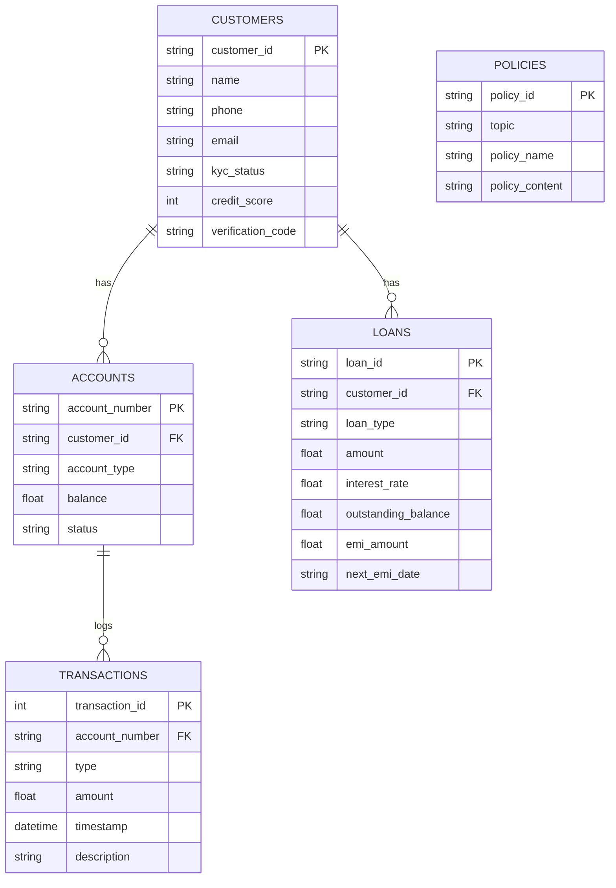

# Walkthrough - BankVerse Voice Integration Completed

We have successfully completed the BankVerse Voice banking voice assistant integration, resolving all task requirements. Below is a detailed walkthrough of what was accomplished, the upgraded database architecture, and how to verify and run the application.

---

## 🚀 Key Improvements

1.  **Upgraded Database Schema (`bank_data.db`)**: 
    Developed a robust, relational SQLite database (replaces the single-table model) containing tables for `customers`, `accounts`, `transactions`, `loans`, and `policies`.
2.  **Database Seeding & Connection Manager (`db_manager.py`)**:
    Constructed seed records in `init_db.py` to populate test scenarios and implemented atomic transactional queries in `db_manager.py` (e.g., thread-safe funds transfer logic with automatic database rollback if balance is insufficient).
3.  **Stateful, Context-Aware WebSocket Stream (`main.py`)**:
    Refactored the WebSocket core to support stateful session variables (`authenticated_customer`, `language`, `auth_pending_customer`). Users must authenticate via voice OTP before checking balances or performing transactions.
4.  **Simulated Voice Text Backup Console**:
    Added text typing simulation options to help staff interact with the voice pipeline using typed commands when microphoning is not available.
5.  **Multi-Language Configuration (Marathi, Hindi, English)**:
    Added Hindi and English language settings. English translations are bypassed automatically to optimize response speeds.
6.  **Sleek Glassmorphic Frontend Dashboard (`App.jsx`, `App.css`)**:
    Modernized the React app with custom Outfit/Plus Jakarta typography, real-time verified badges, an interactive credit score ring chart, active debit cards, a live bouncing audio waveform visualizer, and a CRM summary file exporter.

---

## 💾 Database Schema Details



---

## 🛠️ Verification & Testing Outcomes

We designed two automated test suites in the backend directory to check correctness without requiring external API keys:

1.  **`test_db_manager.py`**: Runs unit test assertions on database queries.
2.  **`test_api.py`**: Simulates complete WebSocket multi-turn conversations (language setup, profiles, auth checks, balances, and summaries) using FastAPI `TestClient`.

### Test Execution Output:

```bash
# Running db_manager unit tests
venv\Scripts\python test_db_manager.py
Running db_manager tests...
Database successfully generated with seed data at C:\Users\Suchit  Jundare\OneDrive\Desktop\BankVerse Voice\backend\bank_data.db!
[OK] test_get_customer_by_name passed
[OK] test_get_customer_by_id passed
[OK] test_verify_customer_code passed
[OK] test_get_customer_accounts passed
[OK] test_get_account_balance passed
[OK] test_get_recent_transactions passed
[OK] test_get_loan_details passed
[OK] test_transfer_funds passed
ALL TESTS PASSED SUCCESSFULLY!

# Running API WebSocket integration tests
venv\Scripts\python test_api.py
Client connected via WebSocket.
[OK] Connected to WebSocket endpoint
[OK] Test 1: set_language passed
[OK] Test 2: request_auth recognized profile
[OK] Test 3: verify_auth successfully logged in
[OK] Test 4: check_balance returned accounts
[OK] Test 5: summarize returned session summary
ALL API INTEGRATION TESTS PASSED SUCCESSFULLY!
```

---

## ⚡ How to Run Locally

### 1. Rebuild & Seed the Database
Navigate to the backend directory and execute:
```powershell
cd backend
venv\Scripts\python init_db.py
```

### 2. Boot the Backend API Gateway
Run the FastAPI gateway:
```powershell
venv\Scripts\python main.py
```
*Note: Ensure your `.env` contains your active `GROQ_API_KEY` for Whisper and Llama model translation pipeline.*

### 3. Launch the Frontend Dev Server
In a separate terminal, navigate to the frontend directory:
```powershell
cd frontend
npm install
npm run dev
```
Open `http://localhost:5173` to interact with the dashboard.
*   **Authentication Trigger**: Type `My name is Rajesh Kumar` or `Look up account ACC88102` in the input bar and press Enter.
*   **Verification Trigger**: The system will prompt you for a verification code. Type `1234` and press Enter to log in Rajesh!
*   **Check Balance**: Speak or type `Check my savings balance`.
*   **Check Transactions**: Speak or type `Show my recent transactions`.
*   **Check Loan**: Speak or type `What are my loan details?`.
*   **Perform Fund Transfer**: Click **Quick Transfer** to simulate a transfer, or type `Transfer ₹500 to Priya`.
